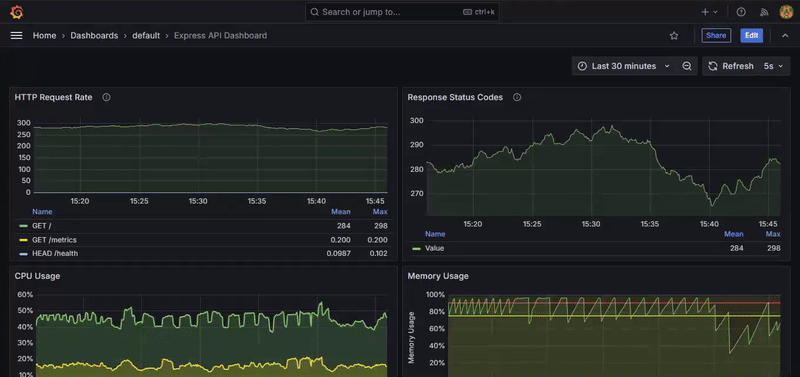

# Express TypeScript Boilerplate

🚀 A production-ready Express.js boilerplate with TypeScript, featuring robust authentication, logging, monitoring, and best practices for building secure and scalable APIs.

> If this boilerplate helps your project take off, consider giving it a ⭐️ - it fuels my cosmic journey! 🌠

# Dashboard Demo



## Features

- **TypeScript** - Strongly typed language for better developer experience
- **Authentication & Authorization** - JWT-based auth with refresh tokens
- **Database Integration** - Prisma ORM with MySQL
- **API Documentation** - REST client files for API testing
- **Security**
  - Helmet for security headers
  - Rate limiting
  - CORS configuration
  - Request validation using Zod
- **Monitoring & Logging**
  - Prometheus metrics
  - Grafana dashboards
  - Winston logger with daily rotate
  - Request ID tracking
- **Performance**
  - Response compression
  - Caching middleware
  - Database connection pooling
- **Testing**
  - Jest for unit and integration tests
  - E2E testing setup
  - Test helpers and utilities
- **Docker Support**
  - Multi-stage builds
  - Docker Compose for local development
  - Health checks
- **CI/CD**
  - GitHub Actions workflow
  - Automated testing
  - Docker image publishing

## Prerequisites

- Node.js (v18 or higher)
- MySQL (v8.0 or higher)
- Docker and Docker Compose (optional)

## Getting Started

### Local Development

1. Clone the repository:
```bash
git clone https://github.com/mzubair481/express-boilerplate.git
cd express-boilerplate
```

2. Install dependencies:
```bash
npm install
```

3. Set up environment variables:
```bash
cp .env.example .env
```

4. Set up the database:
```bash
npm run migrate:dev
npm run seed:dev
```

5. Start the development server:
```bash
npm run dev
```

### Docker Setup

Run the entire stack using Docker Compose:

```bash
# Start all services
npm run docker:dev

# View logs
npm run docker:dev:logs

# Rebuild and start services
npm run docker:dev:build

# Stop services and remove volumes
npm run docker:dev:down
```

#### Development with Hot Reload

The development environment is configured with:
- Nodemon for automatic server restart
- Volume mounts for real-time code changes
- TypeScript compilation on save
- Environment variables for development

```yaml
# Key configurations in docker-compose.dev.yml
services:
  api:
    volumes:
      - ./src:/app/src:delegated        # Source code
      - ./prisma:/app/prisma:delegated  # Prisma schema
      - api_node_modules:/app/node_modules
    environment:
      - NODE_ENV=development
      - CHOKIDAR_USEPOLLING=true
      - CHOKIDAR_INTERVAL=1000
```

This will start:
- Express API server (http://localhost:4300)
- MySQL database (port 3306)
- Prometheus metrics (http://localhost:9090)
- Grafana dashboards (http://localhost:3000)
- Node Exporter (system metrics)
- Alertmanager (alerts management)

### Accessing Monitoring Tools

1. **Grafana**:
   - URL: http://localhost:3000
   - Default credentials: 
     - Username: `admin`
     - Password: `admin`
   - Pre-configured dashboards:
     - API Metrics Dashboard
     - System Metrics Dashboard

2. **Prometheus**:
   - URL: http://localhost:9090
   - Metrics endpoint: http://localhost:4300/monitoring/metrics

3. **Alertmanager**:
   - URL: http://localhost:9093

### Monitoring Features

- Real-time metrics visualization
- Request rate and latency tracking
- Error rate monitoring
- Garbage Collection metrics
- Node.js process statistics
- CPU and memory usage
- Custom alerts configuration
- System metrics via Node Exporter
- Automated alert notifications

## Available Scripts

- `npm run dev` - Start development server
- `npm run build` - Build for production
- `npm start` - Start production server with GC metrics enabled
- `npm test` - Run tests
- `npm run test:e2e` - Run E2E tests
- `npm run test:coverage` - Generate test coverage
- `npm run migrate:dev` - Run database migrations
- `npm run seed:dev` - Seed database with test data
- `npm run studio` - Open Prisma Studio

### Docker Commands

```bash
# Build and start services
docker-compose up -d --build

# Stop services
docker-compose down

# View logs
docker-compose logs -f [service]

# Restart a service
docker-compose restart [service]

# Remove volumes (database data)
docker-compose down -v
```

## Project Structure

```
├── src/
│   ├── __tests__/        # Test files
│   ├── @types/          # TypeScript type definitions
│   ├── config/          # Configuration files
│   ├── controllers/     # Route controllers
│   ├── middleware/      # Express middleware
│   ├── routes/          # API routes
│   ├── services/        # Business logic
│   ├── utils/           # Utility functions
│   ├── validators/      # Request validation schemas
│   ├── app.ts          # Express app setup
│   └── index.ts        # Application entry point
├── prisma/             # Prisma schema and migrations
├── requests/           # REST client files
└── docker/            # Docker configuration files
```

## API Documentation

The API is fully documented using OpenAPI/Swagger. You can access the interactive documentation at:

```
http://localhost:4300/api-docs
```

### API Endpoints

#### Authentication
- `POST /api/auth/signup` - Register new user
- `POST /api/auth/login` - User login
- `POST /api/auth/refresh` - Refresh access token
- `POST /api/auth/logout` - User logout
- `GET /api/auth/verify-email/:token` - Verify email
- `POST /api/auth/send-email-verification` - Resend verification email
- `POST /api/auth/forgot-password` - Request password reset
- `POST /api/auth/reset-password/:token` - Reset password

#### Users
- `GET /api/users` - Get all users (Admin only)
- `GET /api/users/:id` - Get user by ID
- `POST /api/users` - Create user (Admin only)
- `PATCH /api/users/:id` - Update user
- `DELETE /api/users/:id` - Delete user (Admin only)

#### Monitoring
- `GET /health` - Service health check
- `GET /api/monitoring/metrics` - Prometheus metrics
- `GET /api/monitoring/readiness` - Readiness probe
- `GET /api/monitoring/liveness` - Liveness probe

### Authentication

All protected endpoints require a valid JWT token in the Authorization header:

```
Authorization: Bearer <your_jwt_token>
```

### Request/Response Examples

#### User Registration
```json
POST /api/auth/signup
{
  "email": "user@example.com",
  "password": "SecurePass123!",
  "name": "John Doe"
}

Response 201:
{
  "success": true,
  "message": "User registered successfully",
  "data": {
    "id": "uuid",
    "email": "user@example.com",
    "name": "John Doe"
  }
}
```

#### User Login
```json
POST /api/auth/login
{
  "email": "user@example.com",
  "password": "SecurePass123!"
}

Response 200:
{
  "success": true,
  "message": "Login successful",
  "data": {
    "accessToken": "jwt_token",
    "refreshToken": "refresh_token"
  }
}
```

### Error Responses

The API uses standardized error responses:

```json
{
  "success": false,
  "message": "Error message",
  "code": "ERR_XXXX",
  "stack": "Error stack trace (development only)"
}
```

### Rate Limiting

- Auth endpoints: 5 requests per minute
- API endpoints: 100 requests per minute
- WebSocket connections: 60 messages per minute

### Monitoring

The API provides Prometheus metrics at `/api/monitoring/metrics` including:
- HTTP request duration
- Request counts by endpoint
- Error rates
- Active WebSocket connections
- System metrics

### Authentication Flow

1. User signs up → Verification email sent
2. User verifies email via link
3. User can now login
4. Login returns access & refresh tokens
5. Use access token in Authorization header: `Bearer <token>`

### Password Reset Flow:

1. User requests password reset → Reset email sent
2. User clicks reset link in email
3. User sets new password using reset token
4. User can login with new password

### WebSocket API:

- Connection
  - URL: `ws://localhost:4300`
  - Secure URL: `wss://your-domain.com` (production)

- Message Format:
```javascript
{
  "type": "message_type",
  "data": {
    // message payload
  }
}
```

- Supported Message Types:
  - `ping` - Health check ping
    ```javascript
    // Client -> Server
    { "type": "ping" }
    
    // Server -> Client
    { 
      "type": "pong",
      "data": { "timestamp": 1234567890 }
    }
    ```
  - `connection` - Initial connection confirmation
    ```javascript
    // Server -> Client
    {
      "type": "connection",
      "data": {
        "clientId": "abc123",
        "message": "Connected to WebSocket server"
      }
    }
    ```

### WebSocket Usage Example:

```javascript
// Connect to WebSocket server
const ws = new WebSocket('ws://localhost:4300');

// Handle connection open
ws.onopen = () => {
  console.log('Connected to WebSocket server');
};

// Handle incoming messages
ws.onmessage = (event) => {
  const message = JSON.parse(event.data);
  console.log('Received:', message);
  
  // Handle different message types
  switch (message.type) {
    case 'connection':
      console.log('Connected with ID:', message.data.clientId);
      break;
    case 'pong':
      console.log('Ping response received');
      break;
  }
};

// Handle errors
ws.onerror = (error) => {
  console.error('WebSocket error:', error);
};

// Handle connection close
ws.onclose = () => {
  console.log('Disconnected from WebSocket server');
};

// Send a ping message
ws.send(JSON.stringify({ type: 'ping' }));
```

### WebSocket Security:

- Authentication is required for certain message types
- Rate limiting is applied to prevent abuse
- Messages are validated for proper format and content
- Connections are automatically closed after prolonged inactivity
- SSL/TLS encryption is required in production

### Error Codes

The application uses structured error codes for better error handling:

- 1xxx: Authentication Errors (e.g., ERR_1001)
- 2xxx: Authorization Errors
- 3xxx: Validation Errors
- 4xxx: Resource Errors
- 5xxx: Database Errors
- 6xxx: Server Errors

## Contributing

Please read [CONTRIBUTING.md](CONTRIBUTING.md) for details on our code of conduct, and the process for submitting pull requests.

## License

This project is licensed under the MIT License - see the [LICENSE](LICENSE) file for details.